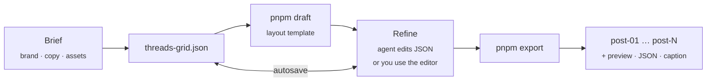
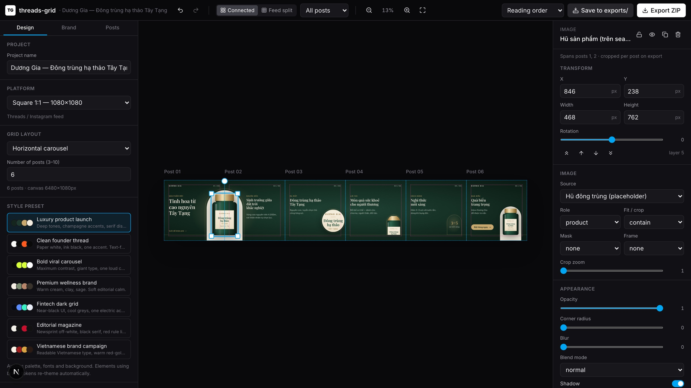

<div align="center">

# threads-grid

**Design connected multi-post grids for Threads and Instagram — as one canvas, exported as perfectly cropped posts.**

An AI agent skill that scaffolds a real visual editor, drafts the first design from your brief,<br/>and exports platform-exact PNGs where headlines, products and backgrounds flow seamlessly from one post to the next.


<br/>


<sub>Six 1080×1080 posts, generated from a one-sentence brief and refined in the editor. The jar crosses the seam between posts 1 and 2; a single champagne line runs through all six.</sub>

</div>

---

## Contents

- [Why threads-grid](#why-threads-grid)
- [Features](#features)
- [Quick start](#quick-start)
- [How it works](#how-it-works)
- [Style presets & layout templates](#style-presets--layout-templates)
- [The editor](#the-editor)
- [Command reference](#command-reference)
- [Export output](#export-output)
- [Project file](#project-file)
- [Repository layout](#repository-layout)
- [Requirements](#requirements)
- [Limitations](#limitations)
- [Credits](#credits)
- [Tiếng Việt](#tiếng-việt)

---

## Why threads-grid

Carousels that *feel* designed are rarely designed one post at a time. The good ones are composed as a single wide artwork — a product that sits between two slides, a headline that pulls you into the swipe, a line that never breaks — and then sliced.

Doing that by hand means fighting crop boxes in a design tool. Generating it with AI usually gives you a one-off static image you can't edit.

**threads-grid gives you both:** an agent that understands your brief and produces a strong first draft, and a real editor you keep using afterwards — with a JSON project file, brand presets, and pixel-exact export.

<table>
<tr>
<td width="50%"></td>
<td width="50%"></td>
</tr>
<tr>
<td align="center"><sub>Post 01 — reads on its own</sub></td>
<td align="center"><sub>Post 02 — and continues the composition</sub></td>
</tr>
</table>

---

## Features

**Connected canvas**
- One canvas split into post frames; any element may span seams and is cropped per post on export
- Horizontal carousels (3–10 posts), 2×2 and 3×3 profile-grid puzzles, vertical story sequences, or custom rows × columns
- Platform presets — Square 1080², Portrait 1080×1350, Story 1080×1920, Landscape 1200×628 — or any custom size

**A real editor, not a template gallery**
- Drag, resize and rotate, with smart snapping to seams, post centers and safe areas
- Double-click to edit text in place; multi-select, marquee, group drag, align & distribute
- Element library: text, image, product, logo, screenshot (phone / browser frame), shape, gradient, decorative line, number badge, quote, CTA
- Inspector for typography, color tokens, radius, shadow, blur, blend mode, crop zoom and focus, masks
- Drag to reorder posts — content inside a post moves with it, seam-crossing art stays put
- Undo / redo, keyboard shortcuts, autosave to `threads-grid.json`

**Brand system**
- Seven art-directed style presets, each with a written creative brief
- Brand color tokens — change the palette and every element re-themes
- Eight bundled typefaces with full Vietnamese coverage, plus custom font upload with an automatic Vietnamese glyph check

**Agent-native workflow**
- `pnpm draft` builds a complete first draft from brand, copy plan and assets
- `pnpm validate` checks the schema, missing files and phone readability
- `pnpm export` renders headlessly, so the agent can review its own output before handing it over

**Export**
- Exact platform pixels, PNG / JPG / WebP, optional 2× / 3× masters
- ZIP bundle with every post, a stitched preview, the project JSON and a posting-order note with the caption

---

## Quick start

### 1. Install the skill

```bash
git clone <this-repo> ~/threads-grid
ln -s ~/threads-grid/skills/threads-grid ~/.claude/skills/threads-grid
```

For a single project, link it into `<project>/.claude/skills/threads-grid` instead. Other agents can be pointed at [`skills/threads-grid/SKILL.md`](skills/threads-grid/SKILL.md).

### 2. Ask for a grid

```text
Create a Threads grid for Dương Gia launching Đông trùng hạ thảo Tây Tạng.
Premium Vietnamese brand style, green and champagne, 6 square posts, product-centered, minimal text.
```

The agent asks only for what is missing, scaffolds the editor, writes the copy, drafts and refines the layout, exports it, reviews the result, and hands you a running editor at `http://localhost:3210`.

<details>
<summary><b>More example prompts</b></summary>

```text
Create a 5-post Threads carousel for my React Native app launch.
Style: clean founder thread, black and white, strong typography, technical but friendly.
```

```text
Create a 3x3 puzzle grid for a wellness brand campaign.
Soft cream background, editorial typography, product image in the center, connected decorative lines.
```

```text
Create a bold viral carousel about "5 mistakes React Native developers make".
6 portrait posts, large headlines, high contrast, modern tech style.
```

</details>

### Without an agent

```bash
~/threads-grid/skills/threads-grid/scripts/scaffold.sh ./my-grid
cd my-grid
pnpm draft connected-headline --style bold-viral-carousel
pnpm dev                      # http://localhost:3210
```

---

## How it works



The editor and the exporter share one renderer, so what you see is exactly what ships. For each post, the full canvas is captured translated by that post's offset into an exact-size frame — seam-crossing elements crop pixel-perfectly, and very wide canvases never hit browser canvas limits.

---

## Style presets & layout templates

| Style preset | Best for | Character |
|---|---|---|
| `luxury-product-launch` | Skincare, tea, supplements, gift sets | Deep tones, champagne hairlines, serif display, product as hero |
| `clean-founder-thread` | Founders, SaaS, build-in-public | Paper white, ink black, one accent, text-forward |
| `bold-viral-carousel` | Hooks, listicles, hot takes | Near-black, giant type, one loud color |
| `premium-wellness-brand` | Health, beauty, nutrition | Warm cream, sage and clay, soft editorial calm |
| `fintech-dark-grid` | Fintech, crypto, dashboards | Dark UI, framed screenshots, one electric accent |
| `editorial-magazine` | Essays, manifestos, campaigns | Newsprint, oversized serif, red rule lines |
| `vietnamese-brand-campaign` | Vietnamese social commerce | Readable Vietnamese type, red-gold or jade, product hero |

Each preset has a full creative brief in [`style-prompts/`](skills/threads-grid/style-prompts) covering palette, type scale, composition and what to avoid.

| Layout template | Signature move |
|---|---|
| `connected-headline` | A giant hook crosses posts 1 → 2; a rule line runs through everything |
| `product-hero-split` | The product sits on the seam between posts 1 and 2 |
| `timeline` | One continuous line, one step per post |
| `quote-thread` | Connected quote cards with a shared rhythm |
| `educational` | Hook → problem → insight → framework → example → CTA |
| `puzzle-grid` | One composition across a 3×3 profile grid, product at the center |

Copy structures, hook formulas, CTA banks and Vietnamese copywriting guidance live in [`copy-ideas.md`](skills/threads-grid/copy-ideas.md).

---

## The editor



| Area | What it does |
|---|---|
| **Design** | Platform, grid layout, style presets, layout templates, add elements, guides, export settings |
| **Brand** | Name, logo, seven color tokens, heading/body fonts, custom font upload, asset library |
| **Posts** | Per-post copy plan and caption; drag to reorder posts |
| **Canvas** | Connected / Feed-split / single-post views, zoom, snapping, drag-and-drop images |
| **Inspector** | Every property of the selection; align & distribute for multi-selections; background and layers otherwise |

<details>
<summary><b>Keyboard shortcuts</b></summary>

| Shortcut | Action |
|---|---|
| `⌘Z` / `⇧⌘Z` | Undo / redo |
| `⌘A` | Select all (only the current post in single-post view) |
| `⌘D` | Duplicate selection |
| `⌫` | Delete selection |
| `Enter` or double-click | Edit text in place |
| `⌘Enter` / `Esc` | Finish editing |
| Arrows / `⇧` + arrows | Nudge 1px / 10px |
| `⌘` + scroll | Zoom |
| `⌘S` | Save now |

</details>

---

## Command reference

Run inside a scaffolded project.

| Command | Description |
|---|---|
| `pnpm dev` | Start the editor on port 3210. Creates `threads-grid.json` on first run and autosaves every change. |
| `pnpm draft <template> [--style <id>]` | Rebuild `elements` from the brief. `--style` also applies the preset palette and fonts. `--list` shows templates. |
| `pnpm validate [--write]` | Schema check plus warnings for missing images or fonts, off-canvas elements, unreadably small text and copy-plan mismatches. `--write` saves the normalized file. |
| `pnpm export` | Headless export of the running editor to `exports/latest/`. |
| `pnpm build` / `pnpm start` | Production build and server. |

---

## Export output

```text
exports/
├── 2026-10-03T11-45-46/            every export is kept
└── latest/
    ├── duong-gia-01.png … -06.png  one file per post, exact platform size
    ├── duong-gia-preview.png       stitched overview of the whole grid
    ├── duong-gia-project.json      snapshot of the project
    └── POSTING-ORDER.txt           publishing order, caption, copy plan
```

| Option | Values |
|---|---|
| Format | PNG (default), JPG, WebP with adjustable quality |
| Scale | 1× exact (default), 2× or 3× masters |
| Numbering | Reading order, or posting order for profile grids (newest appears top-left) |

---

## Project file

Everything lives in a single, human-readable `threads-grid.json`, validated by a Zod schema in which every field has a default. Agents can write it by hand and stay concise.

```jsonc
{
  "name": "Dương Gia — Đông trùng hạ thảo Tây Tạng",
  "style": "luxury-product-launch",
  "preset": "square",
  "layout": { "mode": "carousel", "rows": 1, "cols": 6 },
  "brand": {
    "name": "Dương Gia",
    "colors": { "primary": "#1f4d3a", "accent": "#c9a96e", "background": "#10241b" },
    "fonts": { "heading": "playfair", "body": "be-vietnam" }
  },
  "elements": [
    // canvas coordinates; this jar spans posts 1 and 2
    { "id": "hero", "type": "image", "role": "product", "src": "/uploads/jar.png",
      "fit": "contain", "x": 846, "y": 238, "w": 468, "h": 762 }
  ]
}
```

The full reference — every element type, field and default — is in the [editor README](skills/threads-grid/template/README.md#threads-gridjson-reference).

---

## Repository layout

```text
skills/threads-grid/
├── SKILL.md                 agent workflow, design rules, quality checklist
├── copy-ideas.md            copy structures, hooks, CTAs, Vietnamese guidance
├── style-prompts/           seven art-direction briefs
├── scripts/scaffold.sh      creates a new editor project from the template
└── template/                the Next.js editor
    ├── src/lib/             schema, geometry, store, templates, export pipeline
    ├── src/components/      editor shell, canvas, inspector, UI primitives
    ├── src/app/api/         project, upload and export routes
    └── scripts/             draft, validate, export CLIs
docs/assets/                 images used in this README
```

**Stack:** Next.js 16 · React 19 · TypeScript · Tailwind CSS 4 · Zustand · Zod · react-rnd · dnd-kit · html-to-image · JSZip · Playwright (headless export).

---

## Requirements

- **Node.js** 20 or newer
- **pnpm**, recommended; npm also works
- **Chromium** for `pnpm export`, from any of: Playwright's cached Chromium, Google Chrome, Microsoft Edge, or a binary set through `CHROME_PATH`. Exporting from the editor UI needs no extra setup.

---

## Limitations

- Resize handles stay axis-aligned on rotated elements; snapping already uses the rotated bounds.
- There is no element grouping; multi-select with group drag covers most cases.
- There is no background removal; use transparent PNG product cut-outs for seam-crossing heroes.
- When posts are reordered, elements that cross a seam stay in place by design, because they belong to the connected layout.
- The editor is intended to run locally. Uploads and exports are written to the project folder.

---

## Credits

The structure — an agent skill that ships a real editor, a JSON project file and an export bundle — is inspired by [**ParthJadhav/app-store-screenshots**](https://github.com/ParthJadhav/app-store-screenshots). threads-grid applies the same idea to connected social content.

## License

No license has been chosen yet. Until one is added, all rights are reserved by the author.

---

## Tiếng Việt

**threads-grid** là skill cho AI agent giúp thiết kế bộ bài đăng **liền mạch** cho Threads, Instagram và Facebook. Thay vì làm từng ảnh riêng lẻ, bạn thiết kế trên **một canvas lớn**, rồi xuất ra từng post với kích thước chuẩn của nền tảng. Nhờ vậy sản phẩm, tiêu đề và hoạ tiết có thể nối tiếp nhau qua các post.

- **Chỉ cần mô tả bằng một câu**, ví dụ: *"Tạo Threads grid cho Dương Gia ra mắt Đông trùng hạ thảo Tây Tạng, 6 post vuông, phong cách thương hiệu Việt cao cấp, xanh và champagne."* Agent sẽ viết copy, dựng bản nháp, xuất ảnh, tự kiểm tra kết quả và mở trình chỉnh sửa cho bạn.
- **Trình chỉnh sửa thật**: kéo thả, nhấp đúp để sửa chữ, chọn nhiều phần tử rồi căn chỉnh, kéo để đổi thứ tự post, hoàn tác/làm lại, tự lưu.
- **Chuẩn tiếng Việt**: 8 font có đủ dấu tiếng Việt, kiểm tra dấu tự động khi tải font thương hiệu lên, có sẵn style `vietnamese-brand-campaign` và hướng dẫn viết copy tiếng Việt trong `copy-ideas.md`.
- **Xuất file**: PNG/JPG/WebP đúng kích thước nền tảng, kèm ảnh xem trước toàn bộ grid, file dự án và caption sẵn để đăng.

Cài đặt và sử dụng: xem phần [Quick start](#quick-start) ở trên.
